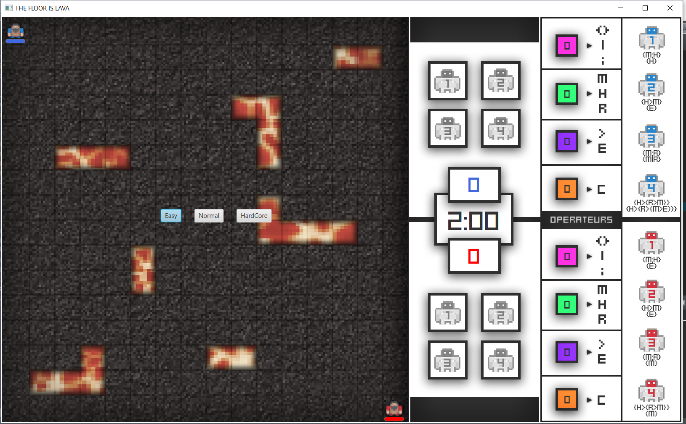
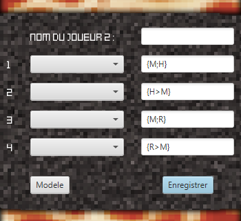
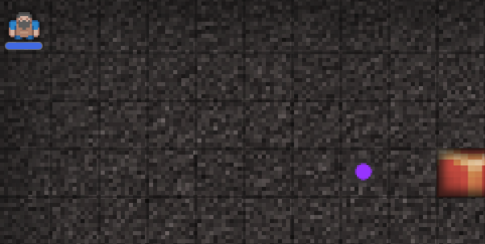

<h1 align="center">
   
  <b>Automatons 2D game</b>
   
</h1>

<h4 align="center">A 2D game including an artificial intelligence</h4>
<i><h5 align="center">3rd year educational project</h5></i>

  
  
  

  <a href="#overview">Overview</a> •
  <a href="#howitworks">How it works</a> •
  <a href="#presentation">Presentation</a> •
  <a href="#screenshots">Screenshots</a> •
  <a href="#license">License</a>

  

## **Overview**

This project was made during my *3rd year* in engineering school.

It main purpose was to create a 2D game with **Java** (and its graphic librairy **[JavaFX](https://openjfx.io/)**) that would use artificial intelligence with *automatons behaviours*. I worked on this project with 5 other students and I was fully in charge of the **graphic design** part. I also helped for the game development (end of the game, implementation of automaton behavior ...).

## **How it works**

The idea of the game is that the player (who can move his character with the arrows keys) has to face enemy robots whose only goal is to reach and hit his character. In order to defend himself against these enemies that spawn frequently, the player can summon allied robots but he needs to collect and gather coins all over the map to do so. These robots can have different purposes that depend on the kind of coins collected (there are 4 different types of them, each represented by a different color):
- attack the enemies by reaching them and hitting them
- collecting coins with the player
- patrol the whole map by moving randomly on it

In addition, it is possible for the player to mix the behaviours (described above) of its robots in order to ensure that he wins. He can do so at the beginning of the game where he can define 4 different kind of robots thanks to sequences. Some of them are explained down below (refer to the selection menu screenshot for a better understanding):
- *M;H* stands for *Move and Hit*, meaning the robot will move randomly and hit and enemy if he is next to him
- *H>M* stands for *Hit and then Move*, meaning the robot will first look after enemies to hit and then move randomly
- *M;R* stands for *Move and Gather*, meaning the robot will move randomly and collect coins

Furthermore, it is possible to combine complex behaviours (for instance *{M;H}>{R;M}*).

The player has 3 lives and loses one of them each time he gets hit by an enemy robot or if he hits an obstacle on the map (represented by lava). He wins if he survives a certain amount of time. Note that it is possible to play against another player.

## **Presentation**

The presentation is available [here](doc/presentation.pptx).

## **Screenshots**

The whole interface can be seen on the first screenshot on top of this file.

This is the selection menu where the player can define the behavior of its robots (note that some behaviors are already predefined and pickable on the left column):

  

Here we can see the character and a certain type of coin he needs to collect:

  

## **License**

© **[Julien Cordat-Auclair](https://github.com/jcordatauclair)**
